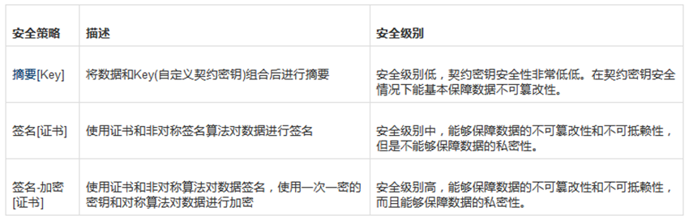
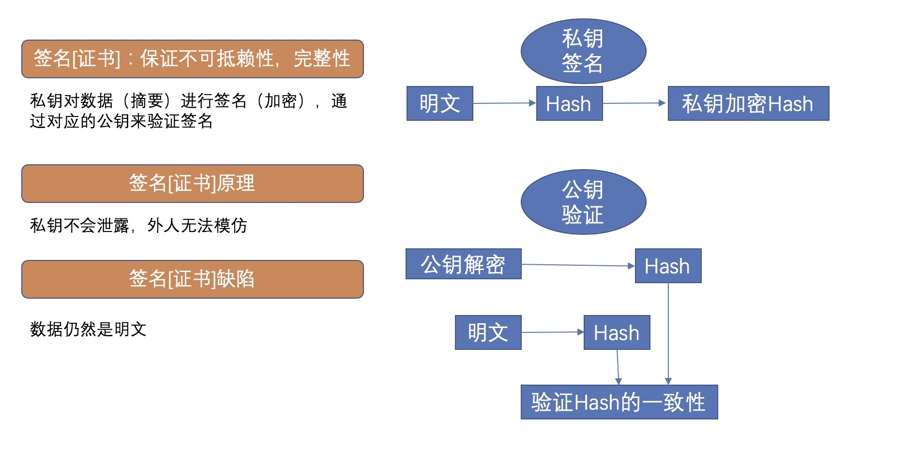
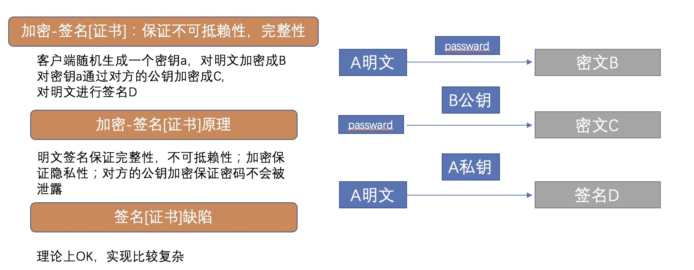

# 如何设计好接口
## 前言

随着业务的发展，系统架构从单体架构变为面向服务架构，水平分层架构；再变为微服务架构，服务网格，服务与服务间
的交互通过rpc协议交互。如何优雅的设计一个接口，需要考虑哪些方面？特别是对公服务（比如BFF）需要对外提供公网域名的接口，安全性
怎么保证，本文整理了一些常见的措施以及具体如何去实现
 
 
## 常见措施
### 防御性编程
### 数据有效性校验
### 幂等设计
 
数据发生改变才需要做幂等，查询接口是天然幂等的<br>
**请求层面：** 多次执行的结果是一致的<br>
**业务层面：** 同一个用户不重复下单，商品不超卖，MQ不重复消费

幂等的本质：分布式锁的问题<br>
分布式环境下，锁定全局唯一资源，使请求串行化，实际表现为互斥锁，防止重复，解决幂等,
分布式锁正常可以通过redis或zookeeper实现，
 
### 安全性
#### 1. 数据加密

我们知道数据在传输过程中是很容易被抓包的，如果直接传输比如http协议传输，那么数据在传输的过程中可能被任何人获取。所以必须对数据进行
加密，常见的做法是对敏感数据比如身份证号进行md5加密。现在主流的做法是使用https协议，在http和tcp之间添加一层数数据安全层(SSL层)，
这一层负责数据的加密和解密。https如何配置和使用，读者可以自行去研究。<br>
**对称加密:** 密钥在加密过程中和解密过程中是不变的，常见的算法有DES,AES;优点是加解密计算速度快；缺点是数据传送前，服务双方必须约定
好密钥，如果一方密钥泄露，加密信息也就不安全了。<br>
**非对称加密:** 密钥成对出现，一个密钥加密之后，由另外一个密钥来解密；私钥放在服务端文件中，公钥可以发布给任何人使用；优点是比对称
加密更安全，但是加解密的速度比对称加密慢多了，广泛使用的是RSA算法；https的实现正好是结合了两种加密方式，整合了双方的优点，在安全性和
性能方面都比较好。<br>
对称加密和非对称加密的代码实现，jdk提供了相关的工具类可以直接使用，本文不过多介绍。<br>

#### 2. 数据签名

介绍3种数据签名安全策略：**摘要[KEY]** , **签名[证书]** , **签名+加密[证书]** <br>

* **机密性(Confidentiality):** 未经许可不许看
* **完整性(Integrity) :** 不许篡改
* **可用性(Availability) :** 防止不可用
* **不可抵赖性(Non-Repudiation):** 用户不能否认其行为

***
**摘要[KEY]过程**：将需要提交的数据通过某种方式组合成一个字符串，然后通过md5生成一段加密字符串，这段字符串就是数据包的签名，比如：<br>
```
str：参数1={参数1}&参数2={参数2}&……&参数n={参数n}$key={用户密钥};
MD5.encrypt(str);
```
**摘要[KEY]原理**：Hash算法不可逆，并且计算结果具有唯一性，在**key** 的隐私得到保证的情况下，可以保证完整性<br>
**摘要[KEY]缺陷**：key的隐私性很难保证，明文传输
  
***
**签名[证书]过程**：客户端对明文做一个md5/SHA计算，对计算后的值通过私钥加密得到密文，客户端将明文和密文发送给服务端，服务端对密文通过
公钥解密得到值A，同时服务端对明文做一个md5/SHA计算得到值B，比较值A与值B，相同得验证通过，能够保障不可篡性和不可抵赖性，但是不能保障
数据的私密性（明文传输）


***
**签名+加密[证书]过程**：客户端生成一个随机字符串，作为password，然后把这个password通过B公钥加密生成密文C，把A明文通过password加密生成密文B，
同时把A明文做MD5/SHA计算后的值通过A私钥加密得到签名D， 把密文B和密文C和签名D发给服务端，服务端通过私钥解密文C得到password，然后通过
password解密文B就可以得到A明文，同时签名可以用来验证发送者是不是A，以及A发送的数据有没有被第三方修改过。<br>
可以假设存在一个恶意的一方X，冒充了A，发送了密文B(password生成），密文C服务端收到数据后，仍然可以正常解密得到明文，
但是却无法证明这个明文数据是A发送的还是恶意用户B发送的。签名D的含义就是A自己签名，服务端可以验证。X由于没有A的私钥，这个签名它无法冒充，
会被服务端识别出来。


#### 3. 时间戳机制

数据经过了加密处理，酒店抓取到了数据也看不到真实数据；但是有不法者不关心真实数据，拿到数据后直接进行恶意请求，这个时候简单的做法可以考虑时间戳
机制，在每次请求中加入当前时间，服务端会将报文中的时间与系统当前时间做比对，看是否在一个固定的时间范围内比如5分钟，恶意伪造的数据是没法更改报文中
时间的，超过5分钟就可以当作非法请求了。伪代码如下：
```
long interval=5*60*1000；//超时时间
long clientTime=request.getparameter("clientTime");
long serverTime=System.currentTimeMillis();
if(serverTime-clientTime>interval){
    return new Response("超过处理时长")
}
```

#### 4. AppId机制

大部分网站需要用户名和密码才能登陆，这其实是一种安全机制；对应的服务也可以使用这一机制，不是谁都可以调用，调用服务前必须先申请开通一个唯一的appid，
提供相关的密钥，在调用接口时需要提供appid+密钥信息，服务端会进行验证。<br>
appid使用字母，数字，特殊符号等随机生成，生成的唯一appid看系统实际要求是否需要全局唯一；不管是否全局唯一最好有以下属性：<br>
**趋增趋势:** 这样在保存数据库的时候，索引的性能更好<br>
**信息安全:** 随机生成，不要是连续的，容易被发现规律<br>
关于全局唯一Id生成的方式常见的有类snowflake方式等


#### 5. 黑名单机制

如果此appid进行过很多非法操作，或者说专门有一个中黑系统，经过分析之后直接将此appid列入黑名单，所有请求直接返回错误码；<br>
我们可以给每个appid设置一个状态比如包括：初始化状态，正常状态，中黑状态，关闭状态等等；或者我们直接通过分布式配置中心，
直接保存黑名单列表，每次检查是否在列表中即可；

### 限流机制

常用的限流算法包括：**令牌桶限流**，**漏桶限流**，**计数器限流**；<br>
* **令牌桶限流**
令牌桶算法的原理是系统以一定速率向桶中放入令牌，填满了就丢弃令牌；请求来时会先从桶中取出令牌，如果能取到令牌，则可以继续完成请求，
否则等待或者拒绝服务；令牌桶允许一定程度突发流量，只要有令牌就可以处理，支持一次拿多个令牌；<br>
* **漏桶限流**
漏桶算法的原理是按照固定常量速率流出请求，流入请求速率任意，当请求数超过桶的容量时，新的请求等待或者拒绝服务；
可以看出漏桶算法可以强制限制数据的传输速度；<br>
* **计数器限流**
计数器是一种比较简单粗暴的算法，主要用来限制总并发数，比如数据库连接池、线程池、秒杀的并发数；
计数器限流只要一定时间内的总请求数超过设定的阀值则进行限流；<br>

具体基于以上算法如何实现，Guava提供了RateLimiter工具类基于基于令牌桶算法：

`
 RateLimiter rateLimiter = RateLimiter.create(5);
`

以上代码表示一秒钟只允许处理五个并发请求，以上方式只能用在单应用的请求限流，不能进行全局限流；
这个时候就需要分布式限流，可以基于redis+lua来实现；


### 服务降级
