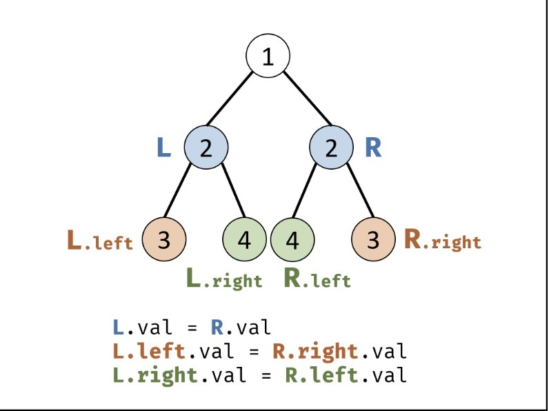

# 对称二叉树

## 题目
请实现一个函数，用来判断一棵二叉树是不是对称的。如果一棵二叉树和它的镜像一样，那么它是对称的。  
例如，二叉树 [1,2,2,3,4,4,3] 是对称的。
```
    1
   / \
  2   2
 / \ / \
3  4 4  3

```
但是下面这个 [1,2,2,null,3,null,3] 则不是镜像对称的:
```
    1
   / \
  2   2
   \   \
   3    3

```

### 解题思路
* 对称二叉树定义： 对于树中 任意两个对称节点 LL 和 RR ，一定有：
  1、L.val = R.valL.val=R.val ：即此两对称节点值相等。  
  2、L.left.val = R.right.valL.left.val=R.right.val ：即 LL 的 左子节点 和 RR 的 右子节点 对称；  
  3、L.right.val = R.left.valL.right.val=R.left.val ：即 LL 的 右子节点 和 RR 的 左子节点 对称。  

* 根据以上规律，考虑从顶至底递归，判断每对节点是否对称，从而判断树是否为对称二叉树。



### 代码
```java
/**
 * Definition for a binary tree node.
 * public class TreeNode {
 *     int val;
 *     TreeNode left;
 *     TreeNode right;
 *     TreeNode(int x) { val = x; }
 * }
 */
class Solution {
    public boolean isSymmetric(TreeNode root) {
        if(root == null){
            return true;
        }
        return recur(root.left,root.right);
    }

    public boolean recur(TreeNode left, TreeNode right){
        if(left == null && right == null){
            return true;
        }
        if(left == null || right == null || left.val != right.val){
            return false;
        }

        return recur(left.left,right.right) && recur(left.right,right.left);
    }
        
}

```