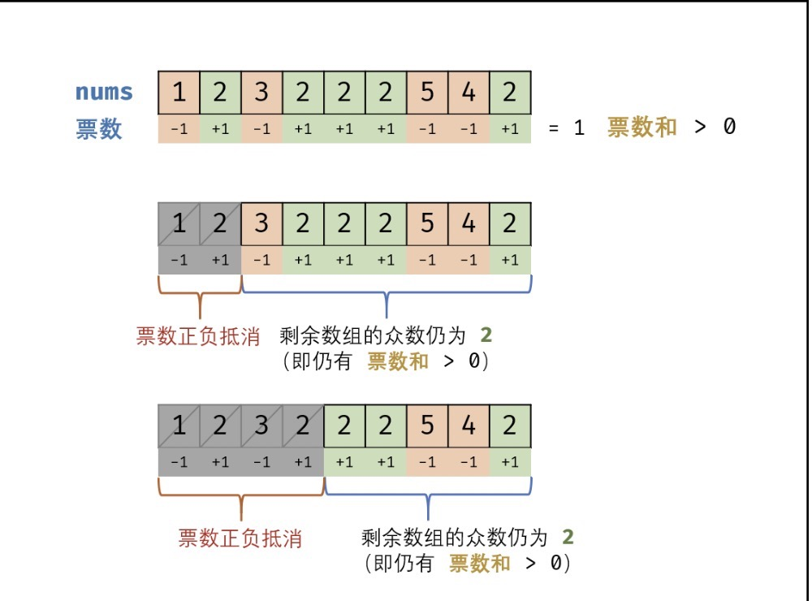

# 摩尔投票法
## 题目描述

**数组中出现次数超过一半的数字**  
数组中有一个数字出现的次数超过数组长度的一半，请找出这个数字。  
你可以假设数组是非空的，并且给定的数组总是存在多数元素。  
**示例 1:**
```
输入: [1, 2, 3, 2, 2, 2, 5, 4, 2]
输出: 2
```

## 解题思路

此题目的三种解法如下所示：  
1. 哈希表统计法： 遍历数组 nums ，用 HashMap 统计各数字的数量，最终超过数组长度一半的数字则为众数。此方法时间、空间复杂度均为 O(N) 。  
2. 数组排序法： 将数组 nums 排序，由于众数的数量超过数组长度一半，因此 数组中点的元素 一定为众数。此方法时间复杂度   $\log_2 10$
3. 摩尔投票法： 核心理念为 “正负抵消” 。时间复杂度为 O(N) ，空间复杂度为 O(1) 。是本题的最佳解法

## 摩尔投票法：
* 票数和： 由于众数出现的次数超过数组长度的一半；若记 众数 的票数为 +1 ，非众数 的票数为 −1 ，则一定有所有数字的票数和>0。      
* 票数正负抵消： 设数组 nums 中的众数为 x ，数组长度为 n 。若 nums 的前 a 个数字的 票数和 =0 ，
则 数组后(n−a) 个数字 众数一定仍为x （即前 a 个数字的票数正负抵消，后 (n-a) 个数字的 票数和仍 >0 ）。


### 算法原理
* 为构建正负抵消，假设数组首个元素n_1为众数，遍历统计票数，当发生正负抵消时，剩余数组的众数一定不变 ，这是因为：
** 当 n_1 = x ： 抵消的所有数字中，有一半是众数。  
** 当 n_1 !=x ： 抵消的所有数字中，少于或等于一半是众数。   
* 利用此特性，每轮假设都可以 缩小剩余数组区间 。当遍历完成时，最后一轮假设的数字即为众数（由于众数超过一半，最后一轮的票数和必为正数）。

### 算法流程:
1. 初始化： 票数统计 votes = 0 ， 众数 x；
2. 循环抵消： 遍历数组 nums 中的每个数字 num ；
* 当票数 votes 等于 0 ，则假设 当前数字 num 为 众数 x ；
* 当 num = x时，票数votes 自增 1 ；否则，票数vvotes 自减1 。
3. 返回值： 返回 众数 x 即可。
4. 复杂度分析：
* 时间复杂度 O(N) ： N 为数组 nums 长度。
* 空间复杂度 O(1) ： votes 变量使用常数大小的额外空间。

### 代码
```
class Solution {
    public int majorityElement(int[] nums) {
        int x = 0, votes = 0;
        for(int num : nums){
            if(votes == 0) x = num;
            votes += num == x ? 1 : -1;
        }
        return x;
    }
}

```

### 出处
https://leetcode-cn.com/problems/shu-zu-zhong-chu-xian-ci-shu-chao-guo-yi-ban-de-shu-zi-lcof/solution/mian-shi-ti-39-shu-zu-zhong-chu-xian-ci-shu-chao-3/